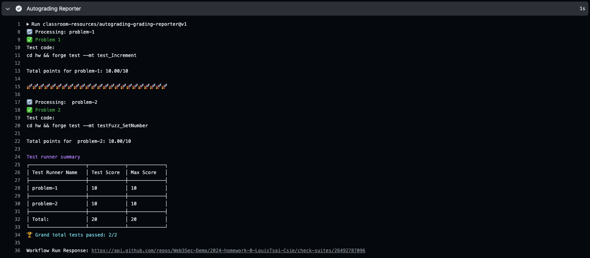
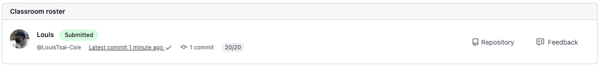
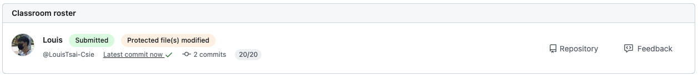

# HW-Template

Assignment Template for GitHub Classroom

## Introduction

This tutorial will guide you through creating your assignment locally and configuring it on GitHub Classroom. Follow the step-by-step instructions carefully to ensure each step is completed correctly.

## Create An Assignment on GitHub
1. Create a new repository by clicking the `Use this template` button.
2. Rename the repository using the format `2024-Fall-HW*`.
3. Choose repository visibility; `Public` is recommended.
4. Design your assignment in the `src/` and `test/` folders.
    - Grading should be based on whether the Foundry tests pass or fail.
    - Do not support analyzing output content for grading.
    - If you install external libraries, run `forge remappings` to link them.
5. Update the autograding configuration in `.github/workflows/test.yml`.
    - Copy the `Problem Template` and adjust the `name`, `id`, `test-name`, `command`, `timeout`, and `max-score`.
    - Add a new entry in `Autograding Reporter` (at the end of the YAML configuration).
6. Commit the changes and push them to GitHub.
7. Check the GitHub Actions and open the `Autograding Tests` workflow to ensure the auto-grading succeeds.

## Create An Assignemnt on GitHub Classroom

1. Go to the relevant GitHub Classroom page.
2. Click the green `+ New Assignment` button.
3. Set up the `Assignment basics` section.
   - Enter the assignment title using the format `2024-Fall-HW*``.
   - Select deadline, and select `This is a cutoff date`[1].
   - Select individual / group assignment
4. Setup `Starter code and environment` section
    - Select the repo for this assignment in the `Find a GitHub repository section`.
    - Choose repo visibility, recommend `Private`[2] access.
5. Setup `Grading and feedback` section
   - Leave the `Add autograding tests` section empty, as grading rules are already configured.
   - Enter protected file path, recommend adding `.github/**/*` since grading rules should not be altered[3].
   - Select `Enable feedback pull requests` to create PR on each assignment.
6. Finish assignment creation, send the invitation code to the students and starting coding!

NOTE:
[1] Once the cutoff date option is selected, student will lose write access to their repository after deadline.
[2] `Private` access means students will create private repositories when receiving the invitation link.
[3] For CTF problems, the `src/` folder should be locked. If students need to fill in blanks in the source contract, consider locking the corresponding test files.

## Check the Assignment Status on GitHub Classroom

1. Check the students' repositories by clicking the `Repository` button on the right side.
2. Provide feedback by clicking the `Feedback` button on the right side and leave comments on the PR.
3. Verify whether students have submitted the assignment and review grading results.
4. Check if students have altered any protected files or folders.

There are several examples:

- Students not submit the assignment.

- Students complete the assignment

- Student change the protected files and folders
